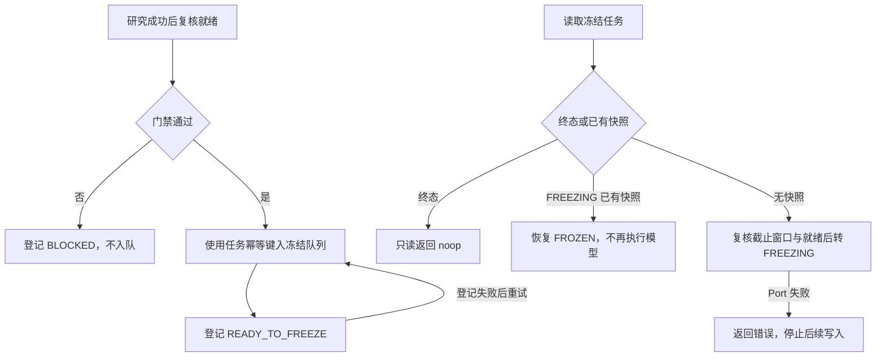
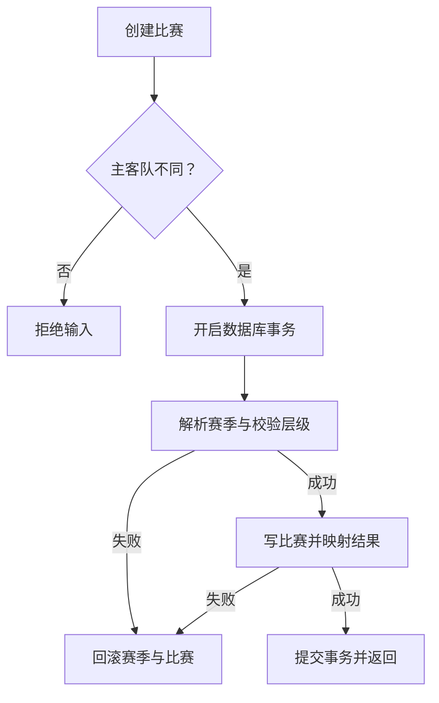

# R07 Match Lineup Workbook Persistence：执行记录索引

## 阶段状态

`IN_PROGRESS`

R7 先完成 R1–R6 累计审计整改，再重写 Matches、Lineups、Presets 与 Workbook 持久化，重点保证双方阵容原子事务、截止时间、历史链路、批次账本、真实 XLSX 行/子记录 identity 与整批回滚；不实施工作簿解析算法本体或前端导入 UI。

## 前置基线

- R6 已正式 `DONE`；阶段记录：[`../R06-entity-catalog-persistence/R06-stage-completion.md`](../R06-entity-catalog-persistence/R06-stage-completion.md)。
- R7 唯一阶段分支：`rewrite/r7-match-lineup-workbook-persistence`。
- R7 分支精确起点：`a25da2bdd2b93d8146e46af60947a687e998f987`。
- R6 最终出口 run `32276040092`：Windows job `96143592950`、PostgreSQL 16 job `96143592734` 均 `SUCCESS`。
- 公共 Lineup/Match/Workbook Port、Domain DTO、0001–0046 migrations、模型保护资产和 UI 默认保持兼容；本阶段不新增生产依赖。

## 当前源码基线

R7 开始时相关 PostgreSQL 职责仍主要分布于：

- `crates/persistence-postgres/src/player_catalog.rs`：Match Catalog 与 Lineup 写读混合；R7-01 首先迁出 Match Catalog，Lineup 留给后续 R7 节点。
- `crates/persistence-postgres/src/lineup_chain.rs`：阵容时间窗口、validation、chain/history。
- `crates/persistence-postgres/src/team_lineup_presets.rs`：球队阵容预设。
- `crates/persistence-postgres/src/spreadsheet_exchange.rs`：Player/Team spreadsheet preview、batch ledger 与 commit 链路。
- `crates/persistence-postgres/src/monthly_workbooks.rs`：monthly team/player workbook persistence。
- `crates/persistence-postgres/src/match_exchange.rs`：match-lineup workbook/export/import persistence。

目标 owner 统一收敛到：

```text
crates/persistence-postgres/src/adapters/matches/
crates/persistence-postgres/src/adapters/lineups/
crates/persistence-postgres/src/adapters/workbooks/
```

## 任务状态

| 任务 | 范围 | 状态 |
|---|---|---|
| R7-01 | Match Catalog | DONE |
| R7-02 | 外部 ID 身份保护 | DONE |
| R7-03 | 普通删除与历史引用保护 | DONE |
| R7-04 | 架构清单、验证器与执行记录对齐 | DONE |
| R7-05 | 关键 Application 用例验证 | VERIFYING |
| R7-06 | 历史数据库失败与账本问题收口 | BLOCKED |
| R7-07 | Lineup Pair Transaction | BLOCKED |
| R7-08 | Lineup Chain / History | BLOCKED |
| R7-09 | Team Lineup Presets | BLOCKED |
| R7-10 | Spreadsheet Batch Ledger | BLOCKED |
| R7-11 | Player Workbook | BLOCKED |
| R7-12 | Team Package | BLOCKED |
| R7-13 | Monthly Workbook | BLOCKED |
| R7-14 | Match Lineup Workbook | BLOCKED |
| R7-15 | Row / Subrecord Identity | BLOCKED |

## R7-02 当前验证状态

进入基线：`c826dd32e3ecb84dfc732ef60c3fd3aaf4153fdf`。R7-02 已 `DONE`：精确提交 `1e4da04` 的 Windows run `36686343584` / job `109792974772` 全通过，见 [节点完成记录](R07-02-external-id-integrity.md)。PG/XLSX/Full 保持最终封包新库待验；R7-03 已 DONE，R7-04 DONE、R7-05 VERIFYING。以下实施条目中的 Windows 待验由本段 CI 证据更新。

- B1 已修订：直接添加与 Spreadsheet commit 共用 `references/external_ids/write.rs` 的 `write_external_entity_id`，接收调用方 PgConnection；唯一键冲突仅在 entity_id 一致时合并 metadata，无条件目标覆盖已删除。跨实体返回原有导入冲突文本，原绑定/metadata 不改。
- 工作簿复用原批次事务并传播冲突，预检后出现竞争绑定仍会拒绝提交，此前业务行、ID、行状态、计数和成功审计一起回滚。预检/冲突裁决逻辑保留；未提前迁移 Workbook owner。
- 已有 `entity_matching_references_repository_contract.rs` 补首次绑定、同实体合并/稳定记录 ID、不同实体拒绝、Barrier 并发争用、同实体并发 metadata 合并、provider/type 隔离、直写与导入交错、批次重试与整批回滚断言。新断言需 PG，最终封包新库待验；原 R6 匹配断言保留。测试连接先检查 test 库名并确认实际库，新 fixture 在 panic 后也尝试清理，保留审计证据。
- 现有 R6-08 verifier 加身份条件、共享 owner/导入事务检查，沿用 architecture/frontend 聚合；无新框架、test target、runner 或 workflow。Domain inventory 由原生成器更新调用面，365 类型/声明摘要不变。
- `npm run verify:architecture`、相关导入静态检查、Rust 源码卫生、Windows acceptance 静态契约、保护资产、命令/迁移检查通过；移除条件、恢复覆盖 SQL 的反向门禁均实际拒绝，源码已恢复。源码按 Rust 1.88 格式化，未做 Linux/macOS 编译/运行验证。
- 公开 DTO/Port/Tauri 命令、正常同实体 metadata 合并、批次返回形态、0001～0046 migrations、依赖/锁文件与模型保护资产保持。历史错误改绑行为被明确拒绝；没有自动纠正已存在的错误数据。
- Windows fmt/Clippy/tests/构建/打包待现有 CI；PG 身份/并发/导入事务断言、真实 XLSX/Full 标记“最终封包新库待验”。待最小门禁实际通过后再关闭节点；B2～B7/A8 不在本节点修复。

## R7-03 当前验证状态

进入基线：`1e4da04b6a6c892dcca4e0499e963d5f39b9746c`。当前 `DONE`：精确修订提交 `073d1557b9fb63edbdff59b851a2897f514ba8f2` 的 [Windows CI run 36695374298](https://github.com/uniquenesssta/123/actions/runs/36695374298) / job `109821951512` 全部 SUCCESS，北京时间 2026-09-30 17:47 完成，见 [节点完成记录](R07-03-safe-entity-deletion.md)。架构、前端、Rust、打包和启动烟测均通过；此前本地未获得通过证据的检查已由本次 Windows 验证补齐。真实 PG/XLSX/Full 保留最终封包新库待验，以下首轮失败和实施记录按当时状态保留。R7-04 已 DONE，R7-05 已启动、当前 VERIFYING，R7-06 及以后 BLOCKED。

- 首轮精确提交 `e657a79700f0c4a0884a8dbef1a301a28e544689` 的 [Windows run 36693857568](https://github.com/uniquenesssta/123/actions/runs/36693857568) / job `109817060757`：架构步骤通过，Automated 在前端契约的 `verify-team-player-management.mjs` 失败（球队比赛/赛后复盘保护断言）；后续 TypeScript/截图/生产构建、Rust 验证、打包/启动未完成，不记 PASS。
- 原因及修复：本轮完整保护已复用 `preflight/references.rs`，原球队管理验证器仍只在 `delete_write.rs` 等写入文件找两项 SQL，未覆盖真实共享链路。本次在原脚本分别检查 Team 写入调用事务复检、helper 调用共享 Team 计数/裁决并拒绝引用，以及 Team 计数 owner 的比赛/复盘 SQL；不新增 runner/工作流或改业务代码。临时移除事务复检、Team 共享计数调用、比赛 SQL、复盘 SQL 均实际拒绝，源码已恢复。
- 修订后原球队管理契约与架构聚合通过；扩大到现有前端入口 86 项 Node 检查，80 项通过，6 项未取得本地通过证据（Node 子进程权限及截图/TypeScript 环境限制），留给 Windows CI 验证；没有将本地检查计为 Windows 实跑，也未修改截图基线或依赖锁文件。

- B2 修订：Player/Team 普通删除事务在任何数据删除前显式设置 READ COMMITTED、取得实体 FOR UPDATE 锁，然后调用完整的共享引用计数和裁决。查询与 UI 预检复用原 owner；不会从 pool 另开连接做最终裁决。等待先行外键写入结束后，复检使用新的语句快照；取得锁后新增受保护外键引用会等待该事务结束。
- Player 新增完整事务内复检；Team 原比赛/复盘两项局部检查被同一完整复检替代，16 项 Team、13 项 Player 既有关系保持（含动态标签、贡献、能力、预设成员、球队阵容预设和赛季成员）。资料/名称等原有正常级联与外部 ID 清理保持；不增加平行关系清单或改写冻结 FK/migration。
- UI 预检仍保留展示和早期拒绝；最终事务拒绝统一沿用“存在历史或业务引用，只允许归档”。此前仅在竞争窗口可能出现的 Team 比赛/复盘专用错误被统一裁决替代，正常已引用路径、missing-entity 和 bulk 结果形态保持。
- 已有 `entity_permanent_delete_repository_contract.rs` 保留空实体可删、外部 ID 清理、单次审计、去重 bulk 与已有效力期拒绝断言；新增实际锁观察的并发交错：Player dynamic tag、Team lineup preset 各验证先行引用提交/回滚两条路径。通过 pg_blocking_pids/锁等待确认顺序，20ms 只轮询真实条件，10s 截止，不以随机 sleep 猜顺序。断言实体/引用/原 external metadata、成功审计、重复删除保持一致；失败/超时中止测试任务，按随机 fixture token 清理并保留审计。
- 测试 URL 通过 SQLx 前检 test 库名，并在迁移前确认 current_database；`safe_delete_rejects_non_test_database_before_connecting` 已在 Windows 实际通过。`safe_permanent_delete_contract_is_preserved` 与 `safe_delete_rechecks_concurrent_history_after_parent_lock` 均 ignored、仅编译通过，所有新增 PG 断言仍为“最终封包新库待验”，不计为实跑通过。
- 现有 R6-09 verifier 保留 owner、预检、归档、bulk、force-delete 边界检查，新增 READ COMMITTED→排他锁→完整复检→变更顺序检查、同一连接计数/裁决与缺口关系断言。临时移除 Player/Team 复检、弱化锁、恢复 REPEATABLE READ 均实际被拒绝，源码已恢复。
- 架构聚合、Rust 源码卫生、171 命令、18 保护资产、迁移兼容与 Windows acceptance 静态契约通过；Rust 1.88 仅用于源码格式化/检查，未执行 Linux/macOS 编译/运行验收。Domain inventory 官方生成器更新调用面，365 类型/声明摘要保持。
- Tauri/Application/Port 直接与 bulk 调用链已核对，公开方法和返回类型无需改变。force-delete 的完整名称确认、专用执行入口、事务/墓碑审计保持，未扩展普通删除权限。R7-04 清单整改、B5/B6/A8/模型历史等后续事项未夹带修复。
- Windows fmt/Clippy/tests/构建/打包/启动已由修订后的现有 CI 验证；本节点真实 PG、已有相关 deletion/force-delete contracts 与 XLSX/Full 在最终新库实跑。没有新增 runner/test target/workflow；回退使用进入基线和受控 revert。

## R7-04 当前验证状态

进入基线：`123823b91709ba4aec056890cbbac8e2b56df134`。当前 `DONE`：精确提交 `9bdb84923da714843e03383db1872aecd30250a2` 的 [Windows CI run 36706905645](https://github.com/uniquenesssta/123/actions/runs/36706905645) / job `109859181344` 全部 SUCCESS，北京时间 2026-09-30 19:34:25 完成，见 [节点完成记录](R07-04-architecture-inventory.md)。架构、前端、Rust、打包和启动验收均通过；Application 当时 33 个单测通过。R7-05 已启动、当前 VERIFYING，R7-06 及以后 BLOCKED。以下实施条目的待验由本段证据更新。R7-01～03 的 DONE 与最终新库待验项保持。

- B3：原 Ports verifier 递归扫描 `ports/**/*.rs`，将实际公开 trait 集合与清单双向比较，拒绝未登记、缺失及重复声明；补齐 Research 2 项和 Review Package 3 项。所有子文件检查 SQLx/PgPool/PgConnection/PostgresStore/PersistenceError、万能 Repository、glob re-export 与未登记 JSON Value，原组合根具体导入唯一约束保持。
- 当前真实扫描为 15 个职责域、43 个公开 trait、19 个 Port 文件、376 个 Application Rust 文件；这些数量由源码产生，不是永久常量。`sourceScan` 保存并验证当前路径/摘要/数量/具体导入集合；R3 的 209/232 与原 run/job 已移至明确的历史 baseline，输出不再声称本次重算持久化调用面。原 verifier 的 `--refresh-source-scan` 仅在声明与依赖门禁通过后刷新扫描材料，不能静默登记未知 trait。
- 递归发现两处既有 JSON 使用：Analytics typed wrappers 的私有转换，以及 Review Package `read_source_run` 的 JSON 返回。为保持本节点公开 Port/DTO 不变，清单明确登记 owner、原因及规范化源码 SHA-256；变化必须重新审查登记，不豁免其中的 SQLx 等禁止依赖。没有把既有返回描述为已类型化，也没有在 R7-04 扩大业务接口改造。
- PostgreSQL `adapter_modules` 改为 `lib.rs` 与 `adapters/mod.rs` 直接声明解析的 owner 路径，33+5 共 38 项；8 个已删除旧根模块登记清除，catalog/competition/rules/matches 等现存路径登记。原 Module Boundaries verifier 核对唯一解析、路径存在、双向集合、重复及 counts；此数量表示所述直接模块范围，不表示所有递归私有模块数量或 Application Port impl 数量。
- B4 现有入口遗漏：R6-03 Player Directory/Detail 在 architecture/frontend 各直接运行一次，原 verifier 增加入口遗漏/重复门禁并改为从脚本定位仓库根；原 Ports verifier 同时补入 frontend。R5 hierarchy/rules/bindings/route/model identity 继续由 competition verifier 间接导入，未再直接重复登记。
- B7：R3-06/07 的权威详细记录为 [Prediction](../R03-application-services/README.md#r3-06-当前结果) / [Research](../R03-application-services/README.md#r3-07-当前结果) 原章节，不复制两份独立记录，原 AT 状态与最终收口的区分已说明。[R6-09 删除记录](../R06-entity-catalog-persistence/R06-09-archive-delete-and-force-delete.md) 订正历史复检承诺，链接 R7-03 完整修复与 CI，未将新增 PG 断言追溯写成旧阶段实跑通过。
- 已实际通过 architecture 聚合、受影响脚本语法/Ports/模块/组合根/R4 adapter/R6-03、171 命令、18 保护资产、迁移兼容及 diff 检查。11 项临时破坏均拒绝：未登记 trait（含 refresh 不得写入）、子文件 SQLx、缺失子文件 trait、重复清单 trait、失效模块 owner、失效 Store owner/声明符号、漏接 R6-03、额外真实模块、既有 JSON 边界扩张及 JSON owner 内 SQLx。临时源码/清单和探针文件已全部恢复。
- 本次只修改原验证器、清单、入口和必要记录；没有改生产 Rust/公开协议/迁移/依赖/锁文件/Domain inventory/模型保护资产，没有新增 runner/test target/workflow。Windows fmt/Clippy/tests/frontend/build/package/runtime 待 CI；本地 Cargo.lock 语义检查因无 Cargo 可执行文件未运行，交由 Windows CI，锁文件未改。真实 PG/XLSX/Full 延期按已有流程保持，不执行 Linux/macOS 构建或运行验收。B5/B6/A8 的后续任务不在本节点实施。Windows 验证完成，已创建 `R07-04-architecture-inventory.md`；回退使用进入基线和受控 revert。

## R7-05 当前验证状态

进入基线：`9bdb84923da714843e03383db1872aecd30250a2`。用户在确认 R7-04 通过后启动本节点，当前 `VERIFYING`：20 个新增行为测试已实现，Rust 执行与 Clippy 等待本轮精确提交的 Windows CI；不能继承 R7-04 的 33-test PASS。R7-06 及以后 BLOCKED。

| 现有模块 | 新增测试 | 真实调用与断言范围 |
|---|---:|---|
| Prediction tests | 6 | 调用真实 execute/execute_internal；上下文→路由→模型→正式写入顺序、输入键回写与路由参数/身份、影子重复执行不落历史、scope/route/model/save 失败阻断、陈旧审计路由及不支持快照拒绝、公开 provider 缺席不能写成功历史。 |
| P4 orchestration tests | 11 | 调用真实 execute_p4_freeze 与研究 finalize；终态取消/失败/冻结重复只读，已有快照恢复及失败后重试不再执行模型/写快照，错误状态拒绝，提前/超时/就绪门禁，Port 故障后的最后成功状态；研究 readiness→幂等入队→READY 的顺序、时间/优先级/重试参数和状态登记失败后的相同 job key。 |
| Exchange export 原 use case 内单测 | 3 | 无效输出位置不轮询会话 future；会话/数据 Port 失败不创建目标工作簿；损坏 XLSX 解析失败不取得会话、不写 preview batch。 |

共享调用记录器只在 `#[cfg(test)]` 的现有 Prediction tests 中以 crate 可见方式提供，生产构建没有此入口。每个未选中的 Port 方法直接 panic，所选方法记录顺序、参数与已成功副作用；错误注入不改变 fake 状态。研究 fake 模拟队列幂等契约，测试验证 Application 传递稳定键，不代替真实 PostgreSQL 队列去重验证。只用模型 API 的 test fake；另有真实公开注册表 unavailable 路径断言，未宣称私有模型可用或算法已验证。

没有修改生产业务逻辑/公开接口/依赖/锁文件/迁移/工作流，也没有新增测试文件、target、框架或数据库专项。Domain inventory 由原生成器更新测试调用面与使用摘要，365 类型/声明摘要保持；原 application-port sourceScan 的路径/数量/指纹保持。沿用现有 Windows workspace tests（包含 football-application），预期 Application 总数为 53；实际数量和结果以本轮 CI 为准。

架构聚合、受影响现有验证器、源码卫生、命令/迁移/保护资产与 diff 检查通过，Rust 1.88 仅用于源码格式化及语法解析。没有执行 Linux/macOS 编译或测试。Windows fmt/Clippy/tests/前端/打包/启动待 CI；新测试不依赖数据库或网络，损坏 XLSX 本地临时输入不是有效工作簿往返验收。真实 PG/有效 XLSX/Full 继续“最终封包新库待验”。未覆盖的完整 research gateway、完整模型冻结成功和真实数据库事务仍按已有后续/最终验收，不虚报本轮覆盖全部流程。CI 成功后才创建 `R07-05-application-use-case-tests.md` 并放行 R7-06；回退受控 revert 本轮测试及使用清单，保留 R7-04 完成证据。



## R7-01 READY 边界

- 处理 Match Catalog 创建、删除、列表、读取及其直接 validation/mapping/query owner，并修复 A1～A7 所需的 Application 调用方、现有验证器、清单和测试。
- 目标目录：`crates/persistence-postgres/src/adapters/matches/catalog/`。
- 不提前迁移 `create_lineup`、`create_lineup_pair`、lineup chain/history、preset 或 workbook 事务。
- 新实现通过最小验证后切换唯一入口，并删除被 R7-01 替代的旧 Match Catalog 职责；不得保留转发壳或双实现。
- 必须保持比赛 external key、competition/season/stage/round scope、主客队校验、列表排序/limit、删除保护与审计语义不变。

## 阶段硬约束

- 双方阵容不得逐侧提交；R7-07 必须由单一 pair transaction 拥有双方写入原子性。
- actual 阵容不得进入赛前快照；截止时间与历史时点语义保持。
- Workbook preview 与 commit 分离；冲突未解决禁止提交；整批失败必须回滚。
- 真实 XLSX 与 PostgreSQL 链路必须验证，不得用 mock 替代要求的真实链路。
- 节点内按影响范围检查，可交付节点/阶段出口沿用现有 Windows 验证；失败阻止虚报通过和推进，允许继续本节点诊断。数据库/XLSX 按任务书第 3 节记录已有执行或最终新库待验，不新增持续回归体系。

## 记录规则

- R7-01 完成时创建 [`R07-01-match-catalog.md`](R07-01-match-catalog.md)，并把 R7-02 切到 `READY`。
- 后续节点按任务书依次创建对应记录；未完成的记录不提前创建为伪完成文件。
- 全部 R7-01～R7-15 完成且最终出口门禁通过后才创建 `R07-stage-completion.md`。

## R7-01 当前验证状态

- R7-01 已 `DONE`：提交 `c826dd3` 的 Windows CI run `36678914535` / job `109769864719` 全通过，详见 [节点完成记录](R07-01-match-catalog.md)。PG/XLSX/Full 保留“最终封包新库待验”。R7-02、R7-03 已 DONE，R7-04 DONE，R7-05 VERIFYING，R7-06 及后续 BLOCKED。
- 以下修复表及审计章节保留当时验证状态；Windows 待验已由上述精确提交的 CI 证据更新，数据库未因 CI 成功转为通过。

### 2026-09-30 R7-01 修复记录（待动态验收）

实施进入基线：本地 `567f4ec0cdb6401240fb9737014b0e01d745bf1b`；远端仍为 `51f746729b2f94925e6382f2ae2108cf80855af6`。沿用当前阶段分支。本记录不代替节点完成记录。

| 审计项 | 本轮修订 | 验证状态 |
|---|---|---|
| A1 | `PersistenceStore::read_match(self, match_id)` 显式走固有公共读取方法；保留错误映射。 | 跨 crate 静态检查通过；Windows 编译待验。 |
| A2 | 官方生成器更新使用摘要、真实调用路径和 975 个扫描文件；365 个 Domain 类型/声明摘要保持。 | Domain inventory 与架构聚合通过。 |
| A3 | Lineups Service 改读新 read owner；Match Workflow 和 History Scoreline 的 scope/delete 检查改读新职责文件，Lineup 原检查继续读原 owner。 | 三个原失败检查均通过，未删业务断言。 |
| A4 | 已有 R7 verifier 接入 `verify:architecture`/`verify:frontend`，覆盖 Application 读取与共享事务；无新 runner/workflow。 | 架构聚合通过；故意恢复旧方法/事务外 pool 的反向检查能拒绝，源码已恢复。 |
| A5 | 已有 contract 覆盖层级冲突、失败无残留、600 行列表上下限/排序、研究保护、AI/外部 ID 释放和单次审计；现有数据库基线及 Windows Full 均显式执行此目标。 | 入口 dry-run 和静态检查通过；PG 真实断言未运行。 |
| A6 | SQLx URL 解析先拒绝非 test 库，再确认 `current_database()`，均在迁移/写入前；将测试体 panic join 后清理本次 fixture。保留不可变共享 schema 和审计证据。 | 新增非数据库 guard 单测待 Windows 执行；已有 runner 的错误协议/非 test 库 dry-run 拒绝验证通过。 |
| A7 | 主客不同校验先执行；scope 解析/自动赛季 upsert、层级校验、比赛写入/映射在一个事务，成功才提交。contract 覆盖赛季新增和既有 archived 赛季 metadata 更新回滚。 | 事务边界静态检查通过；真实 SQL 回滚待新库验证。 |

清理：`scripts/r7-01-apply.py` / `r7-01-recover-callers.py` 仅用于已经完成的 owner 切换，无现有验证入口引用，已删除；回退使用进入基线/受控 revert，不重跑旧脚本覆盖修复。生产依赖、Cargo/Node 锁文件、0001～0046 migrations、Domain DTO、模型保护资产与公开命令均未修改。

验证证据：架构聚合全通过；受影响 Match Workflow/History Scoreline/R7 门禁、Windows 验收器静态契约、46 个 migration 基线通过；现有数据库 runner dry-run 确认两个目标并保留失败退出码。Rust 1.88 仅用于整理源码格式，没有执行 Linux/macOS 编译或运行测试。当前环境没有 Windows 执行面或已授权专用 PG 连接；`verify-cargo-lock-sync.mjs` 因 Cargo 不在 PATH（ENOENT）未能执行，保留给 Windows 门禁，不伪造 CI/数据库结果。

动态待验：Windows Application/Persistence 编译、fmt/Clippy/tests、前端构建与 Automated；`match_catalog_repository_contract` 真实 PG、既有 broad PG 基线与 XLSX/Full 登记为“最终封包新库待验”。历史四项 broad 失败和 A8 保留给 R7-06，B1～B7 按修订任务书执行，未在本轮夹带修复。

引用释放的继承风险：现有删除代码尝试清空 `model.runs.match_id`，但 migration 0041 的输入身份触发器禁止该字段变更；本轮没有改该删除策略，也未用模型运行夹具证明该分支可删。后续数据库收口必须确认不可变模型历史的正确保护语义，不能通过放开历史触发器来完成删除。




## 2026-09-30 用户确认的任务书调整（当前执行依据）

- 保留 R7-01；其后插入 R7-02 身份保护、R7-03 删除安全、R7-04 清单与记录、R7-05 关键用例验证、R7-06 历史问题收口。当前尚未实施这些整改。
- 原 R7-02～10 顺延为 R7-07～15，名称与业务顺序保持。原双方阵容事务必须等待前述整改代码和节点最小门禁完成。
- 不新增持续回归建设任务/框架/runner/workflow/数据库专项入口。只使用已有脚本、已有测试目标和现有 Windows 验收；可修正现有入口遗漏和现有断言。
- 最终封包按用户流程新建数据库。节点不反复建库；无法实跑的数据库/XLSX 项在原记录中登记“最终封包新库待验”，不计为通过，最终封包前必须执行并关闭。
- 约束调整已落入总纲和 R7 任务书：按职责拆分、按影响验证、完整调用链修复、精简记录、composition-only 依赖解释；事务/身份/历史保护等正确性门禁保留。
- A1～A7 → R7-01；B1 → R7-02；B2 → R7-03；B3/B7 及 B4 现有入口遗漏 → R7-04；B5 → R7-05；B6/A8 → R7-06。B4 的新持续回归体系建议不采纳。
- 动态待验清单在各节点实际执行后更新。当前 R7-01 尚无通过的 Windows/PG 验收，新节点未开始；历史 4 项 broad DB 失败也没有因计划调整变成已修复。

| 历史编号 | 当前编号 | 原业务任务 |
|---|---|---|
| R7-02 | R7-07 | Lineup Pair Transaction |
| R7-03 | R7-08 | Lineup Chain / History |
| R7-04 | R7-09 | Team Lineup Presets |
| R7-05 | R7-10 | Spreadsheet Batch Ledger |
| R7-06 | R7-11 | Player Workbook |
| R7-07 | R7-12 | Team Package |
| R7-08 | R7-13 | Monthly Workbook |
| R7-09 | R7-14 | Match Lineup Workbook |
| R7-10 | R7-15 | Row / Subrecord Identity |

以下两节保留审计时的事实、旧编号和当时建议。涉及“尚未调整任务书”“新增持续回归入口”或未来任务归属的建议，现已由本节和修订任务书取代；历史审计结果与未验证限制仍保留。

## 2026-09-30 分支审计与 Windows 验证范围

### 基线、范围与边界

- 审计分支：`rewrite/r7-match-lineup-workbook-persistence`；HEAD：`985f01816060cfd05672bdc03b6771dec7b4e842`。
- R7 起点：`a25da2bdd2b93d8146e46af60947a687e998f987`；累计变更 18 文件，`+1269/-517`。
- 检查覆盖 R7 累计差异、Match Catalog 全部新 owner、Application/Port 调用方、历史验证器、CI、数据库测试入口，以及尚未迁移的 pair transaction、chain/history、presets 和 workbook 的事务/账本/identity 关键链路。这是 R7 范围静态审计，不宣称对整个仓库所有业务完成运行验证。
- 审计 checkout 起始工作区干净。未修改生产源码、测试、脚本、依赖、Schema、迁移或模型资产。
- 用户只要求 Windows 端验证：CI 当前已经使用 `windows-2025`，没有 Linux/macOS job。后续最小门禁、阶段回归、真实 PostgreSQL/XLSX 客户端验证均在 Windows 执行；Linux/macOS 不再作为验收条件。审计环境的静态检查不替代 Windows 验收。

### 已确认问题与归属

| ID / 优先级 | 证据与影响 | 来源 / 处理节点 |
|---|---|---|
| A1 / 高 | `crates/application/src/composition/adapters/lineups.rs:65` 仍调用 `read_match_exchange`；该方法已从 Persistence 删除，`PersistenceStore` 实际是 `PostgresStore` 别名。源码确认 Application 读取链未完成切换，预期阻塞编译；本次未运行 Windows 编译，不伪造编译器日志。 | R7-01 引入；必须在 R7-01 关闭前修复。使用 Persistence 固有公共 `read_match` 边界并验证方法解析，避免 Port 方法自调用递归。 |
| A2 / 高 | `verify-domain-type-inventory.mjs` 实际失败。Domain declaration digest 与 365 个类型保持不变，但 Rust usage digest、扫描文件数（966→975）及 MatchDraft/MatchRecord/MatchStatus/TeamDraft 的调用方清单改变。最新 CI run `32324419622` 于此停止，Windows acceptance 被跳过。 | R7-01 引入的清单同步遗漏；用官方生成器生成、审查声明/调用方差异后提交，禁止跳过漂移门禁。 |
| A3 / 中 | `verify-lineups-service.mjs` 仍要求旧 `match_exchange.rs` 暴露被删除的方法；`verify-match-workflow-ui.mjs` 与 `verify-history-scoreline-ui.mjs` 仍从 `player_catalog.rs` 检查已移走的 scope/delete 内容。这三个检查均实际失败。业务保护代码仍在新 owner，不能将检查失败直接等同于保护逻辑已删除。 | R7-01 引入；迁移权威读取路径并保留原断言，不能删断言或添加双实现掩盖失败。 |
| A4 / 中 | 新 `verify-r7-match-catalog.mjs` 单独通过，但未接入 `verify:architecture`/frontend，且只检查 Persistence 内部调用方，未覆盖 A1 的 Application adapter。 | R7-01；接入门禁并覆盖真实跨 crate 调用链。 |
| A5 / 中 | 新 `match_catalog_repository_contract.rs` 默认 ignored；现有 `run_database_baseline.mjs` 只显式执行 `postgres_integration`，不会运行该新 test binary。现有 CI 没有显式执行该测试。测试缺少比赛层级冲突、列表 limit/排序、受保护删除和审计/引用释放断言。 | R7-01；增加经专用测试库校验的 Windows 执行入口及相关行为断言。未执行不记为通过。 |
| A6 / 中 | 新契约测试只读取连接字符串后立即连接并执行 migrate/写入，未校验数据库名含 test，也未清理所建球队；单独 `cargo test --ignored` 不会经过既有安全 runner。 | R7-01 新增测试缺口；在真实执行前落实专用测试库前检与隔离/清理，避免误连正式库及残留 fixture。 |
| A7 / 中 | `create_match` 在主客队/层级验证前调用 scope resolution；`scope.rs` 自动创建赛季使用 pool 独立提交，因此“指定赛事、缺少赛季且主客队相同”等失败路径可留下赛季。R6 起点已存在同一顺序。 | 继承问题；归 R7-01 Match Catalog，未来业务修复时增加失败无残留的 PostgreSQL 证据；本次不实施。 |
| A8 / 中 | `commit_match_lineup_import` 累加并返回/审计 `ended_previous`，但 `match_exchange.rs:423` 更新批次账本没有持久化 `ended_previous_count`。存在 superseded 旧阵容时响应与账本可能不一致；R6 起点已有该实现。 | 继承问题；归 R7-09 Match Lineup Workbook，并由 R7-05 账本契约覆盖。需真实数据库验证，不能仅靠源码 token。 |

R7-02～R7-10 目标 owner 尚未完成，原模块仍存在是当前阶段计划状态，不据此认定全部都是缺陷。已检查 pair transaction 使用同一事务写入双方，Workbook commit 具有冲突阻断与单批事务，actual 阵容通过 `model_eligible` 和 cutoff 路径隔离，Preset application 为 preview；这些是代码结构证据，不等于并发、回滚或真实 XLSX 验收通过。

### 任务书约束评估（建议，未实施）

结论：核心正确性门禁应保留，模板化结构/流程条款部分过强，且有信息不足的模板字段。本次只实施 Windows 验证范围调整；以下为后续可批准的定向优化，不自动覆盖现行任务书。

| 当前约束 | 判断与调整建议 |
|---|---|
| 总纲 §2.1/§20.2：出现第二职责立即目录化；500 行/24KB 默认硬失败 | 独立状态、依赖或业务职责需要模块边界，但行数应触发审查，不自动决定文件拆分。紧密耦合的事务步骤、私有 mapper/helper 可共置；禁止机械一函数一文件。仅审查当前节点影响范围，未到阶段的旧大文件按原计划迁移。 |
| R7 每节点 §12：所有异步请求都具备 ID、取消/过期丢弃并解除监听器 | 错套 UI 生命周期到 Repository。Repository 应关注事务、超时、锁、错误与取消后的回滚；没有监听器/定时器无需制造对应机制。请求身份和过期 UI 结果由调用方拥有；已提交结果不能因 UI 取消被当作未发生。 |
| 每个原子任务都跑完整 frontend、workspace Clippy/tests | 每个可交付节点仍要有相关最小验证与 Windows 回归；节点内只做相关验证，最终节点和阶段出口保留完整 Windows 回归。影响共享契约或公共入口时提前扩大检查，不反复跑相同成功门禁。 |
| R7 每节点 Input / allowed dependencies / forbidden dependencies 全是“无” | 不是可执行边界，容易误解成禁止 Domain/SQLx 等现有必需依赖。启动节点时应按真实 DTO/Port、SQLx/PostgreSQL 及禁止 UI/工作流所有权填写。 |
| 只允许修改目标模块 | 应允许同根问题所必需的 Application composition adapter、调用方、验证器、inventory 和文档；A1/A3 正是缺少这些衔接。授权不扩展到无关功能或重构。 |
| 最小验证失败立即停止 | 应停止进入下一节点和宣布 DONE，仍可在当前授权范围诊断、修复失败与做独立工作；不能理解为停止所有工作。 |
| 一律按完整固定模板重复记录 | 保留真实变更、兼容、验证、阻塞、回退和权威索引；无变化字段可简短写“无”，文件表与日志可引用唯一记录，避免复制过期事实。 |

必须保留：双方阵容单事务、actual/历史截止时间隔离、冲突未解决不得提交、整批回滚、物理行/子记录 identity、真实 PostgreSQL/XLSX 链路、模型与历史迁移保护、唯一状态 owner、公共兼容面，以及硬性验收失败不得进入下一阶段。

### 本次检查证据与限制

- 使用 `package.json` 实际登记的 32 个 architecture 静态检查逐项执行：30 通过、2 失败（Domain inventory、Lineups Service）。逐项检查用于审计被前置失败遮挡的问题；官方串行门禁仍为失败，未跳过门禁宣称全绿。
- R7 Match Catalog 专项通过；Match Workflow UI 与 History Scoreline UI 静态契约失败。Match Lineup Chain、Player Role Inheritance、Formation Usage、Monthly Workbooks、Import Row Identity、Team Package、Team Package Real Import Recovery、Persistence Adapters 和 171 条命令静态契约通过。
- `verify_database_baseline.mjs`：46 个迁移静态基线通过；`verify_protected_assets.mjs` / deterministic：18 个保护文件指纹通过。相对 R7 起点，模型 API、历史 migrations、Cargo.lock、package-lock.json 未变化。
- 审计调用中曾误用两个不存在的脚本名（`verify-spreadsheet-exchange.mjs`、`verify-database-baseline.mjs`）；另一次读取误用了不存在的 `ports/lineup.rs` 路径。均已按实际清单订正；这些调用错误不归为仓库缺陷，未记为通过。
- 本轮无 Windows 执行环境或专用 PostgreSQL 测试库，未执行 Windows Rust/frontend build、Clippy/tests、真实数据库/XLSX、Tauri 打包和交互验收。Linux/macOS 平台验证未执行且已排除为门禁；跨平台静态材料检查仅作审计证据。
- R7-01 继续 `VERIFYING`；R7-02～R7-10 继续 `BLOCKED`。没有创建伪完成的 `R07-01-match-catalog.md` 或 `R07-stage-completion.md`。

下一步如获修复授权，应先闭合 A1～A7 的 R7-01 链路并在 Windows 完成最小门禁、数据库契约和回归，再更新节点实施记录与状态；A8 留在匹配的后续 R7 节点。该建议不构成开始实施或进入 R8 的授权。

## 2026-09-30 R1–R6 累计执行补审

以下为整改前 `51f7467` 基线的审计发现，保留当时编号、状态和证据。整改后事实以本文件当前任务状态表及 R7-01～04 当前验证段落为准，不以历史段落中的“当前”重新判定进度。

### 审计基线与结论

本节补充并修正前述仅针对 R7 变更的审计范围。审计对象是 `rewrite/r7-match-lineup-workbook-persistence` 当前累计代码，覆盖 R1–R6 全部 **43 个任务节点**、六份阶段任务书、阶段索引/完成记录、现存职责入口、相关静态门禁和关键历史 Actions 证据；不是重审所有历史分支，也不代表逐行穷尽审查或完成新的运行验收。

- 远端 HEAD：`51f746729b2f94925e6382f2ae2108cf80855af6`；生产源码基线：其父提交 `985f01816060cfd05672bdc03b6771dec7b4e842`。GitHub commit 文件表确认两者只差前轮 5 份文档。
- 六阶段引用的代码收口提交均为本地生产 HEAD 的祖先。R1 浏览器/Tauri bootstrap、R2 Domain、R4 Store/Audit/Mapping/Migrations、R5 competition/rules adapters、R6 catalog adapters，相对各自下列收口基线未发生源码变化；R3 后续变动主要是 R4 的 composition adapter 与 DatabaseSession 切换，已纳入本轮核对。
- **R1–R6 主体迁移真实存在，历史阶段完成不能简单推翻；但“DONE”不等于全部原始约束已满足，更不等于当前 R7 可交付。** R6 身份与删除保护发现未闭合的业务契约，R1/R3 机器清单存在覆盖缺口，数据库回归与 fake-port 验证仍有债务。
- **当前进度仍是 R7-01 VERIFYING，R7-02～R7-10 BLOCKED。** R7 删除旧读取方法后漏接 Application 调用方，导致前阶段调用链受损；应先恢复当前分支可验证状态，不能直接推进下一节点。
- 本轮不修改业务代码、测试、门禁或任务约束，不改变历史节点状态，也不创建伪完成记录。补审只追加本地审计文档，未提交或推送远端。

### 逐节点对照

表中“保留”表示职责迁移及现存入口得到源码/静态核对支持，不表示本轮重新完成 Windows 运行验收。B 编号对应后面的累计问题；A 编号对应前轮 R7 问题。

| 节点 | 任务书要求 / 当前职责入口 | 补审判断 |
|---|---|---|
| R1-01 | `architecture/module-boundaries.json`、`state-ownership.json` | 契约已建立；旧 adapter 清单未跟进，见 B3 |
| R1-02 | `scripts/architecture/` 依赖、状态与受保护导入检查 | 检查保留且本轮通过；覆盖边界见 B3 |
| R1-03 | `src/bootstrap/` 创建、注册、启动/销毁 | 保留；入口明确，失败清理与逆序销毁存在；旧 Feature 等待后续阶段 |
| R1-04 | `src-tauri/src/bootstrap/` Builder、state、command registry、error | 保留；171 命令静态契约通过 |
| R1-05 | Application composition、model registry、service | 保留；具体依赖实际按 composition-only 管理，见约束偏差说明 |
| R2-01 | 365 公共类型、Serde/映射/调用方清单 | 类型成果保留；当前调用方清单因 R7 漂移，A2 |
| R2-02 | Domain `competition/`、`routing/` | 保留 |
| R2-03 | Domain `team/`、`player/`、`coach/`、`formation/`、`shared/` | 保留 |
| R2-04 | Domain `lineup/`、`match_record/` | 保留；不能把持久化事务验证算作仅凭类型迁移已通过 |
| R2-05 | Domain `prediction/`、`research/` | 保留；私有模型固定回归仍不在公开仓可验证范围 |
| R2-06 | Domain `review/`、`postmatch/` | 保留；历史 JSON/数据库动态兼容本轮未重跑 |
| R2-07 | Domain `analytics/`、`exchange/`、`ai_workspace/`、`release/` | 保留 |
| R2-08 | Domain 根文件 17 模块声明、显式兼容导出 | 保留；无根级领域定义和公共 glob export，专项检查通过 |
| R3-01 | Application `ports/`，按能力拆分 | 边界存在；登记 38、实际 43 个公开 trait，B3 |
| R3-02 | `services/database/`、`use_cases/database/` | 保留；connect/reset 有 fake-port 测试；连接生命周期后经 R4 调整 |
| R3-03 | Competition / Rules Services 与 use cases | 保留；create_competition 有 fake-port 测试 |
| R3-04 | Teams / Players Services 与 use cases | 保留；业务持久化契约缺口见 B1/B2 |
| R3-05 | Lineups Service、4 类 Port、composition adapter | 职责保留，但 R7 留下失效 `read_match_exchange` 调用，A1 |
| R3-06 | Prediction Service、freeze/snapshot use cases、Model API | 保留；关键流程 fake-port 覆盖不足，B5；独立记录缺失见 B7 |
| R3-07 | Research Service、Fact Pipeline、Gateway、worker、人工冲突 | 保留；B3/B5/B7；本轮未联网执行研究或私有模型 |
| R3-08 | Review / Postmatch / Analytics Services | 保留；Review package 的 3 个 Port 未登记，B3 |
| R3-09 | Exchange / AI Workspace / Release Services | 保留；后续真实 PG/XLSX 验证不由静态委托检查替代 |
| R3-10 | `service/application_service.rs` 与各 facade，独立 P4 orchestration | 根门面已收敛，业务/worker owner 已迁出；检查通过 |
| R4-01 | Store / Error / Pool / Migrations / Health / Statistics | 保留；历史真实 foundation smoke 通过 |
| R4-02 | `audit/`，接受调用方事务 | 保留；`write_audit_event` 要求 Transaction，不能据此推定所有调用业务均原子 |
| R4-03 | `mapping/` time/UUID/JSON/optional/invalid state | 保留；基础映射与业务枚举分开 |
| R4-04 | `register_adapters` + Application composition trait impl | 保留；避免 crate cycle 的实现偏差已记录，不应误报非法循环依赖 |
| R5-01 | competition `directory/`、`detail/` | 保留；旧 `competitions.rs` 已删除 |
| R5-02 | competition `hierarchy/` seasons/stages/rounds | 保留；专项脚本经 competition verifier 间接接入 |
| R5-03 | rules `packages/`，单事务注册模型/规则包/审计 | 保留；同 key/version 内容一致幂等、冲突拒绝路径存在 |
| R5-04 | competition `bindings/` | 保留；专项脚本间接接入 |
| R5-05 | competition `route_resolution/` | 保留；explicit package 与自动候选读取分开，旧 `routing.rs` 已删除 |
| R5-06 | competition `model_run_identity/` 与 registration | 保留；扩入同一 identity 注册写入以清理旧 owner 有合理记录 |
| R6-01 | catalog `teams/directory/`、`detail/` | 保留；Team detail 残留投影已在阶段出口迁入 |
| R6-02 | catalog `teams/names/`、`profiles/` | 保留；业务写与审计使用同一事务 |
| R6-03 | catalog `players/directory/`、`detail/` | 保留；稳定 `(normalized_name,id)` 游标存在，但专项静态检查漏接，B4 |
| R6-04 | catalog `players/names/`、`positions/` | 保留；位置/默认战术角色边界和专项检查存在 |
| R6-05 | catalog `players/team_periods/`、`availability/` | 保留；效力期/可用性验证代码和 retained contract 存在 |
| R6-06 | catalog `abilities/`、`dynamic_tags/` | 保留；历史信号已独立；普通删除并发保护关联 B2 |
| R6-07 | catalog `coaches/`、`formations/` | 保留；formation 使用历史与保存事务存在；4 个 broad DB 失败另见 B6 |
| R6-08 | catalog `entity_matching/`、`references/` | 迁移已完成，但“不改绑”要求未闭合，B1 |
| R6-09 | catalog `deletion/` preflight/archive/safe/force | 迁移已完成，强制删除有显式确认与事务；普通球员删除竞态缺口 B2 |
| R6-10 | catalog `global_search/` | 保留；统一 token/重音/别名谓词与稳定分页检查存在 |

### 历史验证证据与当前状态

下列 Actions 已在本轮重新读取 job/step 状态；这是历史记录核验，不是本轮重新执行。历史 Ubuntu PostgreSQL job 只作为当时数据库契约证据，不恢复 Linux/macOS 客户端验收要求。

| 阶段 | 代码/记录基线 | 核验到的证据 | 限制 |
|---|---|---|---|
| R1 | `08803725dcd9f403ffc25552c27d2a9c0d3acd2d` | [31073166446](https://github.com/uniquenesssta/123/actions/runs/31073166446)，Windows job `92525208547` success | 历史 PostgreSQL/Full 延期不能算通过 |
| R2 | `62b1f622b9c14b33dbaac850812a49c063ccb090` | [31236344727](https://github.com/uniquenesssta/123/actions/runs/31236344727)，专项生成/验证 job success | 本机运行日志结论来自阶段记录，本轮没有重新获取原日志；不是同一项完整 Automated 证据 |
| R3 | `2ecebb9ab0076f27a20d46bc897e63c78aecae3d` | [31593758268](https://github.com/uniquenesssta/123/actions/runs/31593758268)，Windows job `94104353199` success | 33 个 Application 单测不等于所有关键用例 fake-port 覆盖 |
| R4 | `b97587c9d20165018f80040dc2a2c098dbbec177` | [31729577225](https://github.com/uniquenesssta/123/actions/runs/31729577225)，PG foundation smoke job `94546316946` success | scoped foundation 通过；broad 集成历史仅 14/18 |
| R5 | `acb0491003b365b3f775780d8c98ecfdf1e80104` | [31884882480](https://github.com/uniquenesssta/123/actions/runs/31884882480)，Windows job `95012628426` success | 节点 PG 通过记录存在；本轮未逐个下载所有节点运行日志 |
| R6 | `809cfb429ec31c165616e65e1b6169f928ee4dcb` | [32276040092](https://github.com/uniquenesssta/123/actions/runs/32276040092)，Windows `96143592950`、PG `96143592734` success；PG 日志实际有 12 次 `1 passed; 0 failed` | 12 项是 retained 专项，不是 broad 18 项全绿 |
| 当前 R7 | `51f746729b2f94925e6382f2ae2108cf80855af6` | [36665184538](https://github.com/uniquenesssta/123/actions/runs/36665184538)，Windows job `109728224233` failure | 日志明确 Domain 清单漂移；Windows Automated 后续步骤 skipped |

R1/R2/R4/R5/R6 上表所列受审职责目录与对应收口代码相同，有助于确认成果被保留；不能把祖先测试通过替代当前完整依赖链编译。R7 的 A1 正是实现目录不变、下游公开方法删除后仍破坏既有调用链的例子。

### 新增累计问题

#### B1 — 高：R6-08 的“不改绑”约束未覆盖直接外部 ID 写入口

- 要求：R6 任务书第 157 行“同源 ID 不改绑”。
- 现状：`crates/persistence-postgres/src/adapters/catalog/references/external_ids/write.rs:18–20` 在 `(provider_id, entity_type, external_id)` 冲突时直接执行 `entity_id = EXCLUDED.entity_id`。
- 可达链：Tauri `add_external_entity_id` → Players facade/service/use case → `EntityReferencePort` adapter → 此 SQL。校验只限制实体类型和非空 external ID，没有先拒绝已有目标变化；迁移表定义也没有禁止此更新的 trigger。
- 触发：相同 provider/type/external ID 先绑定实体 A，再调用公开入口写入实体 B。SQL 会把对应关系改为 B，后续外部 ID matching 将返回 B。工作簿路径已经有“不自动改绑”检查，但不能覆盖这个直接入口。
- 来源：R6 起点 `7512ee805fcba8cac3c8f334680f200d625808c0` 的旧 `player_catalog.rs` 已有相同 upsert；**这是继承并漏验的契约缺口，不是 R7 新增回归**。R6-08 记录同时承诺保持旧 upsert，说明“兼容旧行为”与“不改绑”之间的冲突未明确裁决。
- 测试：retained `entity_matching_references_repository_contract.rs` 验证首次绑定、matching 和非法输入，没有同源 ID 跨实体重复绑定用例。
- 建议：明确同实体重试允许、不同实体冲突拒绝的契约，并让直接入口与导入入口一致；补真实 PG 冲突回归。本轮仅源码确认，没有向数据库写入或修复。

#### B2 — 高：R6-09 普通球员删除的引用预检与事务脱节

- `deletion/safe_delete.rs:7–11` 在事务外调用 `check_entity_deletion`；`deletion/delete_write.rs:6–35` 随后另开事务、锁 player、写审计并删除，却未重新核验 player 历史引用。
- 可发生的交错：预检返回无引用 → 另一个请求新增并提交该球员 dynamic tag → 删除请求取得 player 行锁并执行 DELETE。`migrations/0005_pre_match_foundation.sql:27–29` 明确 dynamic tag 外键 `ON DELETE CASCADE`，这条新增历史会被普通删除级联移除，而不是按已有引用规则要求归档。
- 行锁取得得晚，不能消除锁之前已经提交的新引用。审计仍写 `reference_check: passed`，但使用的是过期预检结果。
- 来源：R6 起点旧 `player_catalog.rs:332–363` 已有同样顺序；属于 R6-09 继承的并发缺口。节点记录第 27 行笼统声称“最终竞态复检”过强；Team 路径只复检部分关系，不能据此推定 Player 路径完整复检。
- retained deletion contracts 覆盖已有引用/无引用的顺序场景，没有上述交错。风险由源码、事务顺序和 schema 确认，尚未在 Windows + PG 实跑并发复现。
- 建议：普通删除在同一事务取得保护锁后重新验证受保护关系，再执行写入；补确定性并发用例。不要为了修复普通删除而改弱 force-delete 的显式确认和审计要求。

#### B3 — 中：R1/R3 的机器清单不是完整的当前事实清单

- `architecture/application-port-inventory.json` 登记 38 个 Port trait，实际递归扫描 `crates/application/src/ports/**/*.rs` 声明 **43 个公开 trait**。未登记：`ResearchEvidenceLedgerPort`、`ResearchManualConflictPort`，以及 `ports/review/package.rs` 的 `MatchReviewPackageFactsPort`、`MatchReviewPackageSourcePort`、`MatchReviewPackageStatePort`。
- `verify-application-ports.mjs` 只检查清单中的 trait 在各域 `mod.rs` 是否存在；不拒绝额外 trait，也没有递归覆盖子文件的同等 Port 禁止依赖检查。末尾 `209/232` 来源于保存的 `sourceScan`，不能当作本次重新发现调用面的统计。
- `architecture/module-boundaries.json:281` 的 adapter_modules 还列有 8 个已删除根模块：competitions、dynamic_tags、entity_catalog、formation_catalog、name_search、routing、team_catalog、team_force_delete；counts 仍写 32。现有模块边界验证没有核对该列表与现存职责目录一致。
- 本轮这两条静态门禁均通过；**通过仅证明其已实现的检查通过**，不能证明清单无遗漏。相关业务专项脚本仍提供部分额外保护，不应描述成“整个架构门禁无效”。
- 建议：生成并核对当前声明集合/路径，明确历史基线字段与当前事实字段；保持禁止依赖，避免只更新文字计数。这个缺口与 R7 导致的 Domain inventory 漂移 A2 是不同问题。

#### B4 — 中：专项验证未全部成为可重复的持续回归

- R6-03 `scripts/verify-player-directory-detail.mjs` 独立运行通过，但 package scripts、frontend 聚合及其他脚本/正式 workflow 无调用或 import，常规入口不会执行它。
- **订正初步判断：R5 专项未遗漏。** `verify-competition-repository.mjs:1–5` 已 import hierarchy/rule-package/bindings/route-resolution/model-run-identity，再由 architecture 运行；仅在 package.json 搜文件名会误判。
- R5 保留 6 个、R6 保留 12 个 repository contract test 文件，均显式 ignored。正式 Windows Automated 只运行普通 workspace tests；`run_database_baseline.mjs` 与 Windows Full 的 DB 步骤都只指定 `--test postgres_integration`，不会执行这 18 个 retained targets。临时阶段 workflow 曾运行它们，但已清理。
- 因此没有否认历史通过；缺口是当前常规验收缺少这些专项行为的持续执行，甚至 Full 也没有补齐。A5 是相同问题在 R7 新测试上的延续。
- 新增测试普遍直接读取 `FOOTBALL_TEST_DATABASE_URL` 并 migrate/write；例如 R5 competitions 与 R6 references/deletion 没有 baseline runner 那样的数据库名称前检。环境变量命名和 `#[ignore]` 能防误触普通 cargo test，但不能保证显式运行时目标一定是专用库。
- 建议：保留 ignored 安全默认，增加唯一、持久、可在 Windows 执行的专用数据库契约入口；校验目标和隔离策略，显式列出 R5/R6/R7 targets，并接入合适的节点/阶段门禁。无需为此恢复 Linux/macOS 客户端矩阵。

#### B5 — 中：R3 的 fake-port 可测试结构已建立，关键编排验证仍偏薄

- Application 源码共找到 33 个测试声明；fake-port 测试集中在数据库 connect 1 项、reset 2 项、create_competition 1 项。另有预测输入摘要、Fact Pipeline、人工决策等纯逻辑测试，它们有价值，但不等于对跨 Port 流程执行的验证。
- Prediction `execute_prediction` 使用 generic `PredictionAccess`，Research 也有明确 Ports；结构上可以隔离测试。当前未找到通过 fake ports 验证正式/影子运行持久化差异、freeze/research 状态流转、关键中途失败副作用边界的测试。
- 对照 R3 阶段矩阵“fake ports use-case tests / 关键流程不启动 PostgreSQL 即可验证”，应记录为覆盖债务，不能仅以 33/33 宣称此目标充分完成。也不能反过来认定全部 Service 迁移失败。
- 建议：只补有实际风险的编排/失败路径；不要求每个纯委托函数另写一个镜像测试，不把不存在的私有预测模型作为测试先决条件。

#### B6 — 中：4 个历史 broad PostgreSQL 失败尚无闭环证据

R4 完成记录 §13、R6-07 实施记录和阶段索引已明确记载；本轮确认 broad 测试文件在 R7 中未修改，未发现把四项修复并重新通过的记录。本轮没有重跑，所以以下是**仍待关闭的历史失败**，不是新测出的四项失败。

| 测试 | 已记录原因 | 建议归属 |
|---|---|---|
| `match_lineup_chain_versions_model_selection_and_freeze_gate_are_consistent` | confirmed 夹具只有 10 人，与 11 人约束冲突 | R7-03，并覆盖与 freeze 的接口 |
| `match_scope_inference_and_lineup_pair_transaction_are_atomic` | kickoff / T-6h 夹具不在有效窗口 | R7-02，关联 R7-01 scope |
| `structured_match_events_are_queryable_and_revision_aware` | result_snapshot 缺 MatchResultRecord 必填字段 | R10-02 |
| `p4_stage_c_writes_are_idempotent_and_frozen_history_is_immutable` | PostgreSQL 微秒精度与内存 DateTime 精确比较不一致 | R8 Evidence/Freeze 相关节点先定位 owner 再修复 |

前三项按历史诊断属于夹具更新，第四项属于实际 P4 持久化时间比较问题；不能统一标为“都是环境问题”，也不能因 R6 的 12 个专项通过就宣称 broad 18/18。应在当前权威阶段索引保持任务归属和退出条件，不必倒退重做已经通过的 R4 foundation。

#### B7 — 低：记录格式不完全达标，不能误判为代码未执行

- `R03-06-prediction-service.md` 和 `R03-07-research-service.md` 未创建；任务书要求独立节点记录，但实际详细 AT、提交和 CI 证据集中在 R03 README 的对应章节。本轮查到完整推进与关闭信息，所以不能说 R3-06/07 没做。
- 部分节点正文保留历史 `VERIFYING`/“下一节点未开始”叙述，而阶段索引和末尾收口更新为 DONE；读取孤立段落容易误判进度。R6 最终完成记录也未集中列出此前 4 项 broad 失败，需跨文档追踪。
- 建议：确定一个当前状态表；节点记录引用历史证据，历史叙述标明时间/提交。可以补独立记录或明确批准合并记录格式，无需为了固定模板重新执行全部测试。

### 约束强度的修正判断

**任务书在文件形态、记录模板和重复执行要求上偏强，在关键行为契约与持续验证覆盖上仍有缺口。** R1–R6 的真实成果说明职责拆分方向有效；B1/B2/B3/B4 说明“更多目录、更多静态字符串检查、更多次全量 CI”不自动等于更可靠。

| 约束 | 累计执行证据 | 建议 |
|---|---|---|
| 第二职责立即递归目录化、500 行/24KB 硬失败 | R6 catalog 212 个 Rust 文件，其中 53 个 ≤10 行，48 个是 mod.rs；文件数本身不能证明过度拆分，部分 Row/Mapper 分离有明确用途 | 改为职责审查；独立状态/外部集成/事务必须有明确边界，紧密耦合私有实现可共置；行数触发评审而非自动拒绝 |
| R1/R3 “Application 不依赖具体 adapter” | 实际 Cargo 仍依赖 persistence，composition-only 为机器契约认可；R4 专门消除了 ActiveDatabase wrapper，DatabaseSession 是 type alias | 明确选择现有 composition-only 规则，不能一边要求该实现、一边用旧 crate-level 禁令判失败。若未来确需 crate 隔离，应独立设计，不在 R7 临时拆新 crate |
| Port/接口处“禁止具体实现泄漏” | DatabaseSession alias 不产生新类型隔离；facade 和 DatabaseService 仍知道该会话类型，核心 use cases 多经 generic Ports | 把 facade/session 的例外与核心用例依赖规则写清；不要把换名字等同于彻底解耦 |
| 每个异步操作都要求 request ID/cancel/dispose | R7 Repository 模板混入 UI 生命周期措辞 | Repository 约束事务、锁、超时和取消后的结果；UI 请求状态仍由调用方负责，无监听器时不制造销毁层 |
| 每个细分步骤反复全量 frontend/workspace/打包 | R4-04 多轮失败仅是旧路径 verifier、环境准备或生成控制流；也确实抓到 concrete leak，不能全部取消 | 节点内部跑受影响检查；可交付节点和阶段出口保留 Windows 全量验收；同一源码树复用已验证证据，阶段 DB 必须显式跑相关 retained contracts |
| 兼容一切旧行为，同时强制身份/历史数据保护 | B1/B2 为继承问题，纯搬迁保留了与目标冲突的行为 | 冻结公开格式和正常行为；已确认违反业务不变量的旧行为单列修复决策与回归，不能静默当作兼容完成 |
| 固定 23 节重复文档、只准目标目录 | R3-06/07 证据实际在索引；R5-06 合理跨入同一 identity 写入；R7 A1 漏接真实调用方 | 留目标、影响边界、契约、验证、失败/延期、回退和状态；允许直接调用方、adapter、清单和验证器随同修复 |
| Linux/macOS 验证 | R1/R2 记录已采用 Windows-only，R5/R6 又出现非目标客户端环境失败 | 继续统一 Windows 客户端门禁。数据库真实验证仍保留，历史其他 OS 日志不删除、不作为新交付要求 |

应保留的硬约束：稳定实体身份、普通删除保护历史引用、双方阵容单事务、actual/赛前 cutoff 隔离、未解决冲突禁止导入、整批回滚、真实 PG/XLSX、公开契约与模型保护资产。修改这些正确性约束无法解决当前完成度问题。

### 本轮检查与下一步顺序

- 独立执行 package 中 32 条 architecture 静态脚本，30 通过、2 失败：Domain inventory 与 Lineups Service。分开执行用于暴露后续问题，不声称聚合门禁通过；R5 competition 脚本还间接运行 5 个子检查。
- 额外 8 个静态检查通过：Browser bootstrap、Tauri bootstrap、Application composition、Player Directory/Detail、Global Name Search、database baseline、protected assets、command contract。
- 这些是读取源码/契约的静态审计证据；没有执行 Linux/macOS 平台编译或运行验收，也没有在本轮运行 Windows 编译、Clippy、Rust 单测、frontend build、Tauri、真实 PG、XLSX 或人工 Full。
- 最新 Windows CI 的实际失败已从 job 日志确认。R7 A1 的失效调用由源码确认，本轮没有伪造编译器报错。
- 业务源码、测试、门禁、依赖与历史迁移均未修改；约束调整仍是建议。

建议后续顺序（尚未授权实施）：

1. 闭合 R7-01 A1/A2/A3 与其测试入口/数据库契约，恢复当前分支可验证状态。
2. 单列 R6-08 身份保护、R6-09 普通删除竞态的补验/修复；不要掩入 R7 正常进度或把前六阶段全部改成未完成。
3. 对齐 Port/adapter 当前清单并补持续验证入口，明确 R3 关键 fake-port 覆盖与 4 项历史 DB 债务的退出节点。
4. Windows 节点验收通过后再关闭 R7-01；其余 R7 节点按真实依赖推进，Windows Full/用户现有数据库/私有模型最终验收继续保持显式未执行状态。
