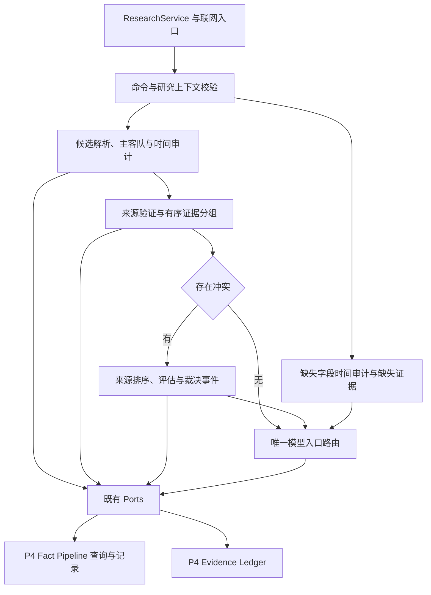

# R8-09 Fact Pipeline：完成记录

状态：**DONE**。分支 `rewrite/r8-prediction-p4-orchestration`；实施基线 `6718c996613edc6e4770457ed02fff16f8a95e26`，精确实施提交 `4025781f2f0419f374edfa7669a4c5bcfe71ee66` 已取得自身Windows全链路SUCCESS。下文保留实施时的预期/待验文字供追溯，当前完成事实以末尾收尾节为准。用户已授权“收尾09 开始10”；10前置通过，11～12继续BLOCKED。

## 前置与实际问题

08修复CI [37817443918](https://github.com/uniquenesssta/123/actions/runs/37817443918) / job `113449572979` 全SUCCESS，2026-10-09 02:02:35（北京时间）完成，Clippy首轮失败已关闭。五文档收尾 `6718c99` 已推送，没有混入本次09源码变更。

原Application Fact Pipeline已在R3按计算职责初拆；实际问题是242行mod仍混合公共命令、组合trait、artifact注册、处理编排和每事实输入准备。Postgres1044行旧根owner混合8公开方法/9helper和2测试。继续已有正确模块，按独立职责拆混合部分，不机械搬整个文件、不重建已退出旧根入口、不添加空State/协调器/模板p4目录。

## 唯一职责与链路

| owner | 责任与关系 |
|---|---|
| Application command | 原ProcessResearchEvidenceCommand，序列化/公共根路径保持 |
| Application process | 组合FactPipelineAccess；命令/context/index校验→全部事实准备→BTreeMap有序组→缺失字段→summary |
| Application prepare | 主客队过滤、实体决定/写入、时间审计/写入、事实来源索引查找和PreparedFact分组输入 |
| Application已有职责 | entity_resolution/time_audit/source_policy/evidence/conflict/routing/validation/types继续原计算；artifact注册归source_policy |
| Postgres source_policy | 原策略前检、key/version事务锁、不可变版本、首次元数据与同事务audit |
| Postgres context/candidates | 研究上下文typed读取；比赛/日期/实体候选及等分/排序政策 |
| Postgres entity_resolution/time_audit | 各独立追加账本/读回/状态解析 |
| Postgres conflicts | 冲突评估及裁决事件的同一生命周期，复用08冲突头/member |
| Postgres routes/fingerprint | 路由记录、ID排序去重；该目录原精确指纹冲突错误 |

两个mod只登记/显式出口。Application所有原通配导入改为具体owner依赖；Postgres不依赖Application，SQL/Row只留adapter。ResearchService/OpenAI/P4 worker/公开facade/composition原调用路径不变，PostgresStore同名方法由新文件直接实现。08 evidence_ledger和p4/idempotency不复制；事实指纹helper的原提示不同，继续该目录自身owner。

Mermaid Chart已展示上述真实链路；无尚未实现的模型或事务包装。

## 兼容、错误及副作用

命令DTO/公开类型路径、43 Ports及签名、8 PostgresStore方法、171 Tauri命令、365 Domain类型/300映射、Schema/路由版本、配置、日志、UI、生产依赖/锁文件、46迁移均不变。模型算法/参数/P4.4 SHADOW_ONLY/P7概率与18保护资产不改，不将公开unavailable stub当私有Golden Master回归。

保留全事实准备后才分组证据写入、BTreeMap顺序和最后缺失字段处理。等分候选不猜测，主客队与历史候选日期不变；截止纳秒判断和SQLx微秒落库原精度分别保持。来源等级由已验证URL域名决定，来源/冲突安全赢家、路由入口及原幂等键/指纹字段/排序去重规则不改。

命令无效在context之前停止；context比赛键/cutoff/schema不一致在账本之前停止。来源缺失原本在该事实实体和时间写入后返回错误，已写记录仍保留，后续claims/routes不执行；完整pipeline不是原子事务。来源策略仍原同key版本锁/事务audit，其他记录仍原独立ON CONFLICT/读取首次记录/精确指纹冲突，不新增事务包装、自动重试、默认值或吞错。Port错误kind/message完整返回；新增测试覆盖主链和冲突各失败点。无跨调用共享State、缓存、计时器或UI监听生命周期。

## 全部变更文件

新增（13）：

- `crates/application/src/use_cases/research/fact_pipeline/command.rs`
- `crates/application/src/use_cases/research/fact_pipeline/prepare.rs`
- `crates/application/src/use_cases/research/fact_pipeline/process.rs`
- `crates/persistence-postgres/src/adapters/p4/fact_pipeline/candidates.rs`
- `crates/persistence-postgres/src/adapters/p4/fact_pipeline/conflicts.rs`
- `crates/persistence-postgres/src/adapters/p4/fact_pipeline/context.rs`
- `crates/persistence-postgres/src/adapters/p4/fact_pipeline/entity_resolution.rs`
- `crates/persistence-postgres/src/adapters/p4/fact_pipeline/fingerprint.rs`
- `crates/persistence-postgres/src/adapters/p4/fact_pipeline/mod.rs`
- `crates/persistence-postgres/src/adapters/p4/fact_pipeline/routes.rs`
- `crates/persistence-postgres/src/adapters/p4/fact_pipeline/source_policy.rs`
- `crates/persistence-postgres/src/adapters/p4/fact_pipeline/time_audit.rs`
- `docs/modular-rewrite/R08-prediction-p4-orchestration/R08-09-fact-pipeline.md`

修改（22）：

- `README.md`
- `architecture/application-port-inventory.json`
- `architecture/database-baseline.json`
- `architecture/domain-type-inventory.json`
- `architecture/module-boundaries.json`
- `crates/application/src/use_cases/research/fact_pipeline/conflict.rs`
- `crates/application/src/use_cases/research/fact_pipeline/entity_resolution.rs`
- `crates/application/src/use_cases/research/fact_pipeline/evidence.rs`
- `crates/application/src/use_cases/research/fact_pipeline/mod.rs`
- `crates/application/src/use_cases/research/fact_pipeline/routing.rs`
- `crates/application/src/use_cases/research/fact_pipeline/source_policy.rs`
- `crates/application/src/use_cases/research/fact_pipeline/tests.rs`
- `crates/application/src/use_cases/research/fact_pipeline/time_audit.rs`
- `crates/application/src/use_cases/research/fact_pipeline/types.rs`
- `crates/application/src/use_cases/research/fact_pipeline/validation.rs`
- `crates/persistence-postgres/src/adapters/p4/mod.rs`
- `crates/persistence-postgres/src/lib.rs`
- `crates/persistence-postgres/tests/postgres_integration.rs`
- `docs/TESTING.md`
- `docs/football-model-platform-modular-rewrite-19-docs/08-R8-prediction-p4-orchestration.md`
- `docs/modular-rewrite/R08-prediction-p4-orchestration/README.md`
- `scripts/verify-research-service.mjs`

删除（1）：

- `crates/persistence-postgres/src/fact_pipeline_records.rs`

移动/重命名：**无**。按职责提取，非整文件移动；保留原9项Application/2项Persistence测试。以本项基线 `git diff --no-renames --name-status` 核对，13A/22M/1D共36文件，08五文档收尾已在基线内。

## 测试与验证证据

原Application target新增7项：

- invalid_command_and_context_stop_before_ledger_writes
- pipeline_preserves_context_source_and_repeatable_idempotency_keys
- opposite_team_candidate_never_enters_home_route
- missing_source_preserves_prior_resolution_and_time_audit_only
- port_errors_keep_kind_message_and_stop_at_the_failed_step
- missing_field_retrieved_after_cutoff_is_stale_and_blocked
- official_conflict_resolution_writes_evaluation_event_then_selected_route

原Persistence target新增7项：4个记录owner各一项known/unknown/case/padding状态边界，精确指纹及原提示一项，候选等分/不同ID/名称归一一项，来源策略等级上界/空值/重复tier/归一重复域名一项。实施预期 **Application99/Persistence163**（92+7/156+7），未在本地运行Rust测试，必须以09自身Windows实跑日志核对。

原Stage C/E测试入口扩充真实context/candidates和四类记录、事件；核对首次id/time/fingerprint、内容冲突拒绝、SQLx微秒时间、路由selected IDs排序去重、事件唯一和不可变trigger；来源策略保留首次metadata/单次audit/无效前检零记录。仍18 broad/原target，无新增设施；真实PG结果最终新库待验，ignored编译不计实跑PASS。

实际本地PASS：

| 验证 | 结果 |
|---|---|
| 原verify-frontend源码列表逐项node运行 | 83/83；原5浏览器项留Windows |
| npm run verify:architecture | 完整通过；Research门禁由文件数检查改为owner/明确依赖/调用顺序/事务与幂等/旧入口删除 |
| Rustfmt 1.88.0目标check | 25当前Rust文件通过；只是格式，不是Linux动态验收 |
| verify_protected_assets / verify-command-contract | 18文件，聚合d74e0936b60c69f444a498405fed3e704b8db63b81f26b40036f772b4b6eac57；171命令 |
| verify_database_baseline | 46连续迁移/18PG静态契约/不可变约束通过 |
| git diff --check | 通过 |
| 生产等价核对 | 17Postgres生产函数/8签名、18raw SQL及208字符串；32原Application helper、artifact注册、序列化命令、prepare重新内联编排相同 |
| 六临时破坏探针 | 目录泄漏实现、HashMap无序组、删cutoff校验、错误主客队filter、漏route ID去重、指纹前缀放宽均拒绝，源文件全部恢复后门禁通过 |

中间首次architecture提示Application sourceScan漂移，已用原refresh命令精确390→393并复跑，不放宽Ports/依赖断言；Postgres旧直接owner删除后36→35；Domain扫描1060→1071，365/300及声明sourceDigest保持，使用方摘要据真实代码重新生成；PG baseline只刷新原test文件blob。没有把本地静态PASS冒充Windows/Rust/真实DB结果。

对照与门禁临时报告放在工作区中间目录，无新增仓库runner或持续框架；记录可由原脚本、基线git show及当前源文件复算。最终CI由已有 `.github/workflows/ci.yml` 自动触发，执行前端/17视口、fmt/Clippy/workspace tests、Windows release/MSI/NSIS/启动；启动后停止轮询，成功前本项VERIFYING。

## 待验、偏差与回退

仅Windows动态验收；本地未运行Linux/macOS Cargo、客户端、浏览器交互、release或安装。真实PG、历史四项/账本、有效XLSX、Windows Full、私有Golden Master以及继承model.runs/0041历史删除风险仍最终封包新库待验。本项没有改历史删除trigger，不宣称此前风险已解决。10～12禁止提前实施。

按实际Rust owner使用既有research/fact_pipeline和Postgres p4/fact_pipeline，替代任务书过期模板；原已拆纯职责继续复用，只拆真实混合职责。选择保留原部分写入/精度/政策以保持兼容，未扩展全pipeline原子化。CI成功前不能DONE；下一项须授权。

回退用受控revert恢复 `6718c99` 基线，同步owner/注册/显式出口、原测试/门禁/清单和节点文档，不手工复制旧文件造成双实现，不变更历史库。结束时Create State保存精确实施提交、CI启动位置、VERIFYING与上述约束，不替代Git和本记录。

## 精确Windows验收与收尾（2026-10-09）

精确实施 `4025781f2f0419f374edfa7669a4c5bcfe71ee66` / [Windows run `37825126808`](https://github.com/uniquenesssta/123/actions/runs/37825126808) / job `113475889770` 全SUCCESS，完成于2026-10-09 02:56:31（北京时间）。日志确认Application **99** / Persistence **163**、14项新增事实边界测试、前端契约/类型/生产构建、**17**视口、fmt/Clippy/workspace tests、Windows release/MSI/NSIS与启动 **7条记录 / 3个完成操作**全部通过。报告 `logs/windows-acceptance-20261008-183420.json`；artifact `11571947799`，14,024,945字节，SHA-256 `5030ebbe6a3a7ffa551c404a7733297e555faf44c21776bdfee34c7c616cdd9e`。

已核对精确SHA、全部job/steps、完整日志和artifact；实施预期99/163现由Windows实跑确认。本次09收尾仅同步五份既有文档，复用同源码树证据，文档提交用 `[skip ci]`，不重复全量构建。原实现文件13A/22M/1D不变，累计变更清单已完整；09正式DONE，10用户授权开始，11～12BLOCKED。真实PG/历史四项/账本/有效XLSX/Windows Full/私有Golden Master和继承历史删除风险仍最终封包新库待验，18 broad ignored不计通过。