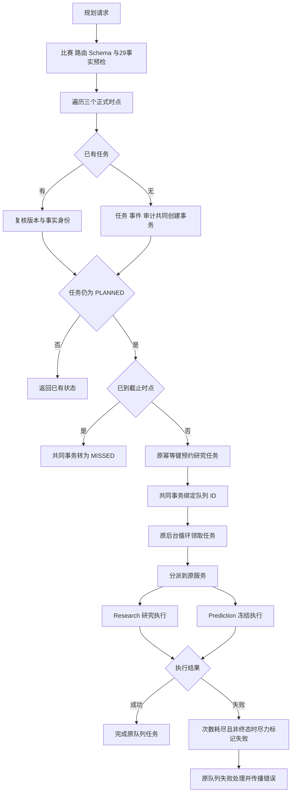

# R8-10 Horizon Orchestration 实施记录

状态：`VERIFYING`。2026-10-09，用户授权“收尾09 开始10”。唯一分支 `rewrite/r8-prediction-p4-orchestration`；09精确实施 `4025781f2f0419f374edfa7669a4c5bcfe71ee66` / [Windows run 37825126808](https://github.com/uniquenesssta/123/actions/runs/37825126808) 全SUCCESS，Application99/Persistence163，09文档收尾基线 `7c1ccd34f9d72d13fc5d4b76104cbb248fc2c63a` 已推送。10等待本记录所在实施提交的精确Windows门禁，不继承09结果；11/12 BLOCKED。

## 实际问题与行为决定

原planner集中预检、时点/draft/队列组装与逐时点I/O；原跨服务文件同时领取、载荷分派与结算；Postgres根混合规划引用、任务事务、事件、映射及后续readiness/Freeze。按真实责任拆分，保留已有目录和公开入口，不建立过时模板或空State。

已确认的缺口：任务create成功后enqueue或transition失败，重试find-existing分支只复核身份并返回PLANNED，无法继续。修复在身份检查后只恢复PLANNED：未来复用 `p4-research-job:{task_id}` 原队列幂等键预约并绑定；截止相等或已过，共同事务转MISSED。ResearchQueued及其他推进/终态原样返回。首建过期任务继续直接MISSED、不入队；不加入自动重试循环。队列已成功但绑定失败时重试得到同job；若之后已过期，不删除既有job，原worker终态规则负责处理。此恢复是明确行为修复，其他提取按等价核对。

原T-24h/T-6h/T-1h、固定六版本与29事实、显式P4路由、单次时钟、原键/载荷、15分钟研究lead/grace、priority10/20/40与3 attempts保持。T-90m/T-N只读兼容。Persistence写入仍只要求非空事实（不擅自改为Application的29字段政策）。公共API/DTO/Schema/数据格式、43 Ports、171命令、配置/原错误及日志/UI、模型算法参数/保护资产、依赖/锁文件和0001～0046保持；新过期恢复事件使用原transition DTO与reason/payload字段。

## 职责与入口

| 职责 | 实际owner |
|---|---|
| 比赛、显式路由、时点能力、全部事实与两Schema预检 | plan_p4_horizons/prepare.rs |
| 原时点身份与draft纯组装 | plan_p4_horizons/schedule.rs |
| PLANNED恢复、截止判断、原预约与状态绑定 | plan_p4_horizons/queue.rs |
| 顺序编排三个正式时点 | plan_p4_horizons/process.rs |
| 原载荷/任务种类解析与跨服务委托 | p4_orchestration/dispatch.rs |
| 领取与结果结算 | p4_orchestration/process_next.rs |
| 原次数耗尽终态保护 | p4_orchestration/failure.rs |
| 规划context/Schema/run读取 | adapters/p4/horizon/context.rs |
| 纯前检、事实规范化与原指纹 | adapters/p4/horizon/input.rs |
| 任务/事件只读查询 | adapters/p4/horizon/read.rs |
| 首建/状态事务与原事务锁 | adapters/p4/horizon/tasks.rs |
| 借用事务的事件身份/追加 | adapters/p4/horizon/events.rs |
| 任务/事件与兼容时点状态投影 | adapters/p4/horizon/row.rs |

原PredictionService经plan_p4_horizons::execute显式出口调用process；原P4Service调用process_next，dispatch只委托Research/Prediction执行。组合适配器/Ports不变。原复合P4OrchestrationAccess移入生命周期owner并显式导出；failure缩小内部约束至实际使用的PredictionWorkflowPort，settlement只要求workflow/queue，未改变Port契约。各mod只登记/导出；方法impl自然保留PostgresStore公共路径。

原Postgres根18函数（含9公共方法）迁入新职责，剩余 `p4_freeze_readiness`、`p4_route_readiness`、`p4_readiness`、`find_frozen_p4_snapshot_id`、`p4_routed_facts` 五函数原样保留供后续审查。没有提前迁移Workbench或冻结执行/快照事务，无完整文件移动/删除/重命名，无空转发和重复owner。

## 状态、事务与生命周期

PreparedPlan及now属于单次请求；顺序await遇错误即停，前面任务和已经成功的Port副作用保留。创建→预约→绑定仍是独立操作，三个时点没有整体事务。新恢复利用原队列幂等性，不承诺原子分派或并发重规划永不冲突。

首建仍纯前检后begin→同键pg_advisory_xact_lock→首次指纹复核/重试读回或insert→event→audit→commit；requested facts只排序去重，纳秒原输入/trace/state/metadata仍进入指纹。迁移仍begin→FOR UPDATE→同next_state直接无写返回→expected/合法状态检查→原COALESCE/Null blockers政策→event/audit→读回commit。事件只借用事务，原idempotency/event fingerprint及冲突保护保持；不逃逸事务。

原worker AtomicBool、30秒轮询、数据库断连退出和任务取消策略不变，不新增线程、缓存、监听器或UI请求生命周期。后台成功只complete原job；失败达到上限才尽力标记合法非终态FAILED，再调用原fail队列，fail错误按原优先级覆盖执行错误；transition/读取/畸形载荷的尽力处理保持。

## 完整文件清单

与基线7c1ccd3比较：14新增（13 Rust+本记录）、20修改；移动/重命名：无；删除：无。

| 操作 | 文件 |
|---|---|
| 新增 | `crates/application/src/use_cases/p4_orchestration/dispatch.rs` |
| 新增 | `crates/application/src/use_cases/p4_orchestration/tests.rs` |
| 新增 | `crates/application/src/use_cases/prediction/plan_p4_horizons/prepare.rs` |
| 新增 | `crates/application/src/use_cases/prediction/plan_p4_horizons/process.rs` |
| 新增 | `crates/application/src/use_cases/prediction/plan_p4_horizons/queue.rs` |
| 新增 | `crates/application/src/use_cases/prediction/plan_p4_horizons/schedule.rs` |
| 新增 | `crates/persistence-postgres/src/adapters/p4/horizon/context.rs` |
| 新增 | `crates/persistence-postgres/src/adapters/p4/horizon/events.rs` |
| 新增 | `crates/persistence-postgres/src/adapters/p4/horizon/input.rs` |
| 新增 | `crates/persistence-postgres/src/adapters/p4/horizon/mod.rs` |
| 新增 | `crates/persistence-postgres/src/adapters/p4/horizon/read.rs` |
| 新增 | `crates/persistence-postgres/src/adapters/p4/horizon/row.rs` |
| 新增 | `crates/persistence-postgres/src/adapters/p4/horizon/tasks.rs` |
| 新增 | `docs/modular-rewrite/R08-prediction-p4-orchestration/R08-10-horizon-orchestration.md` |
| 修改 | `README.md` |
| 修改 | `architecture/application-port-inventory.json` |
| 修改 | `architecture/database-baseline.json` |
| 修改 | `architecture/domain-type-inventory.json` |
| 修改 | `crates/application/src/services/p4_orchestration/mod.rs` |
| 修改 | `crates/application/src/services/p4_orchestration/tests.rs` |
| 修改 | `crates/application/src/use_cases/p4_orchestration/failure.rs` |
| 修改 | `crates/application/src/use_cases/p4_orchestration/mod.rs` |
| 修改 | `crates/application/src/use_cases/p4_orchestration/process_next.rs` |
| 修改 | `crates/application/src/use_cases/prediction/plan_p4_horizons/mod.rs` |
| 修改 | `crates/application/src/use_cases/prediction/tests.rs` |
| 修改 | `crates/persistence-postgres/src/adapters/p4/mod.rs` |
| 修改 | `crates/persistence-postgres/src/p4_orchestration.rs` |
| 修改 | `crates/persistence-postgres/tests/postgres_integration.rs` |
| 修改 | `docs/TESTING.md` |
| 修改 | `docs/football-model-platform-modular-rewrite-19-docs/08-R8-prediction-p4-orchestration.md` |
| 修改 | `docs/modular-rewrite/R08-prediction-p4-orchestration/README.md` |
| 修改 | `scripts/verify-persistence-mapping.mjs` |
| 修改 | `scripts/verify-prediction-service.mjs` |
| 修改 | `scripts/verify-research-service.mjs` |

## 验证与异常记录

本地执行环境仅作源码/格式验证，未运行Linux/macOS Cargo、客户端动态或浏览器验收：

- 原verify:frontend列表的83项源码门禁通过，5浏览器项交Windows；报告 `/workspace/scratch/eb298ad5cdcb/r810-static-checks.json`。
- 完整 `npm run verify:architecture` 返回0；第一次原Mapping gate仍指向旧根CompetitionKind调用，修正为实际horizon/context owner后完整复跑通过，未降低检查。
- 同Rust 1.88/Rustfmt1.8工具格式化并检查23目标Rust文件，原source hygiene及 `git diff --check` 通过。
- 原保护资产18项，aggregate `d74e0936b60c69f444a498405fed3e704b8db63b81f26b40036f772b4b6eac57`；171命令契约、46连续迁移与18PG静态契约通过，迁移aggregate `d9f2eb50bacd747b7cbf08492189c2635b7c0ec2cf4c764def1d32a837f8ba93` 不变。
- 23原Postgres函数（create前检重新内联后）函数/签名/SQL/字符串保持等价；规划prepare、identity、draft与未来queue载荷，dispatch、terminal failure及settle match核对保持。恢复分支单独记录，不冒称原execute完全等价；报告 `r810-equivalence.json`。
- 六破坏探针：非正式时点、漏身份、错PLANNED条件、错job键、去FOR UPDATE、漏审计，全部拒绝并恢复；恢复门禁通过，报告 `r810-negative-probes.json`。源码批次与刻意去锁探针曾重叠造成该单项失败，恢复后串行复核通过，83项最终全通过；没有将刻意破坏留入提交。

复用原Probe/原Application target新增15项（8planner、1截止恢复、6结算/失败边界），原Persistence target新增6项纯前检/指纹/解析边界；预期Application114/Persistence169尚未实际执行，必须本项精确Windows CI确认。Probe测试模块和task_fixture仅在cfg(test)扩大crate可见性复用，无生产导出。

原postgres_integration Stage C复用同fixture/专用库入口，扩任务首次值/微秒读回/纳秒指纹、事实排序去重/同键并发、错身份拒绝、context/Schema/run读回、FK创建和状态失败回滚恢复、队列绑定/同状态无写、expected/非法迁移、时点列表顺序、唯一创建/迁移审计及事件/固定身份不可变。18 broad数量不变且仍ignored；编译不算PG实跑。无新test target、runner、workflow、数据库或持续回归设施。

原生成器刷新Application393→399/43 traits（Port源码不变）、Domain1071→1084/365类型/300映射/声明摘要保持，仅usage及来源消费路径更新。Postgres根module清单35不变；数据库runtime_sources只刷新原PG test blob。规范化比较保存于可重建scratch报告，Git与本记录为交付依据。

## 实际链路

Mermaid Chart按下图更新已实现链路，Research/Prediction内部执行仍原owner，没有绘制新私有模型功能。

## Windows待验、回退与下一步

沿用原Windows Automated，推送本实施提交触发完整frontend/17视口/类型构建、Rust fmt/Clippy/workspace tests、Windows release/MSI/NSIS/启动，启动后停止轮询。当前10 VERIFYING，不将预期测试数/历史09/ignored标为本项PASS。精确head成功后才能补完成证据、收尾10；11/12尚未开始。

真实PG/历史四项/账本/有效XLSX/Windows Full/私有Golden Master与继承model.runs/0041删除风险仍最终封包新库待验，公共unavailable stub不冒充真实模型回归。回退用受控revert至7c1ccd3，同步owner/出口/测试/门禁/清单与文档，不手工复制双实现或修改历史数据。Create State在本轮结束记录正确足球模型ID、精确提交/CI待验、重要决定与后续约束；不替代Git或任务书。
